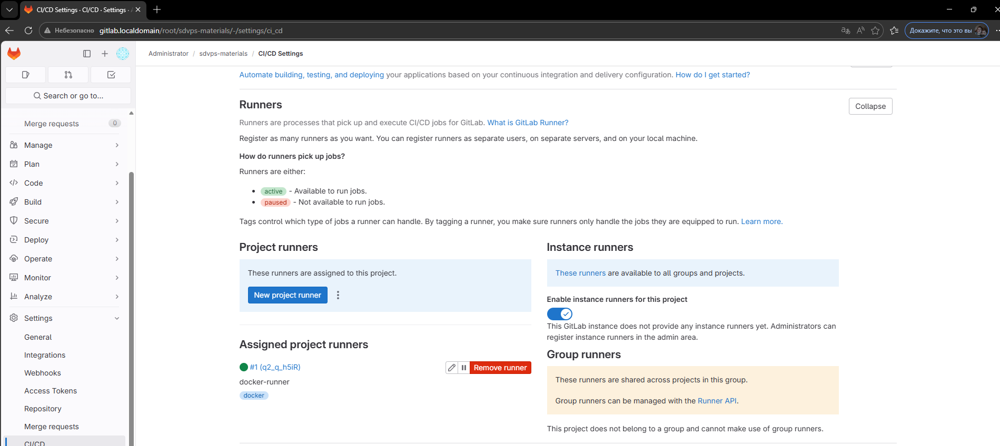
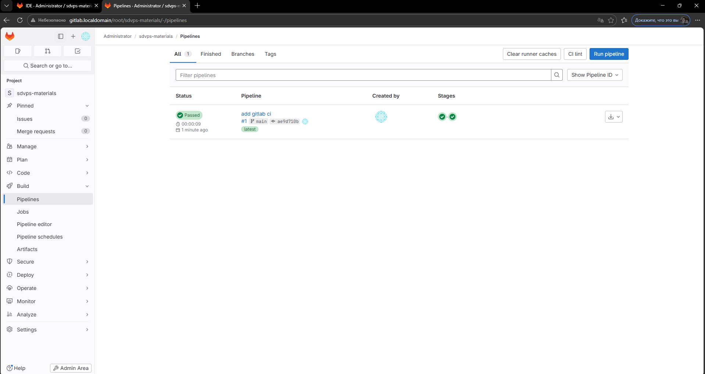
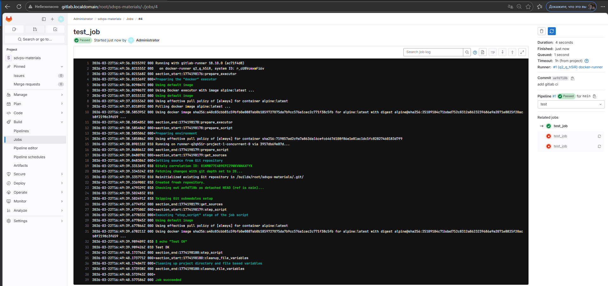

# Домашнее задание к занятию «GitLab» — Скоробогатов Евгений

---

## Задание 1

### Что было сделано

- Развернут GitLab локально через Vagrant
- Создан проект `sdvps-materials` в GitLab
- Запущен GitLab Runner в Docker
- Runner успешно зарегистрирован и переведен в статус `online`

### Скриншот



---

## Задание 2

### Что было сделано

- В проект добавлен файл `.gitlab-ci.yml`
- Настроены стадии `test` и `build`
- Pipeline успешно выполнен
- Получены успешные сборки jobs

### Дополнительно

Репозиторий был запушен в GitLab с изменением origin:

```bash
git remote add origin http://gitlab.localdomain/root/sdvps-materials.git
git push -u origin main
```
### Файл `.gitlab-ci.yml`

```yaml
stages:
  - test
  - build

default:
  tags:
    - docker

test_job:
  stage: test
  image: alpine:latest
  script:
    - echo "Test stage"

build_job:
  stage: build
  image: alpine:latest
  script:
    - echo "Build stage"
```
### Скриншоты




